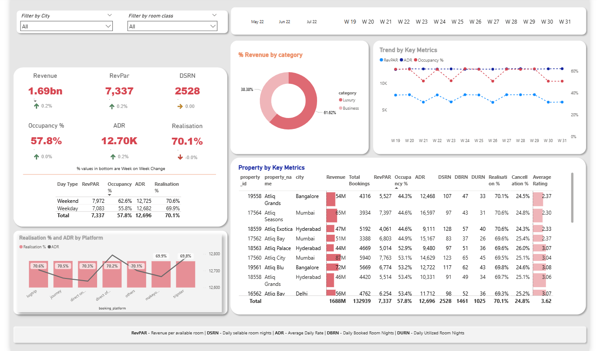
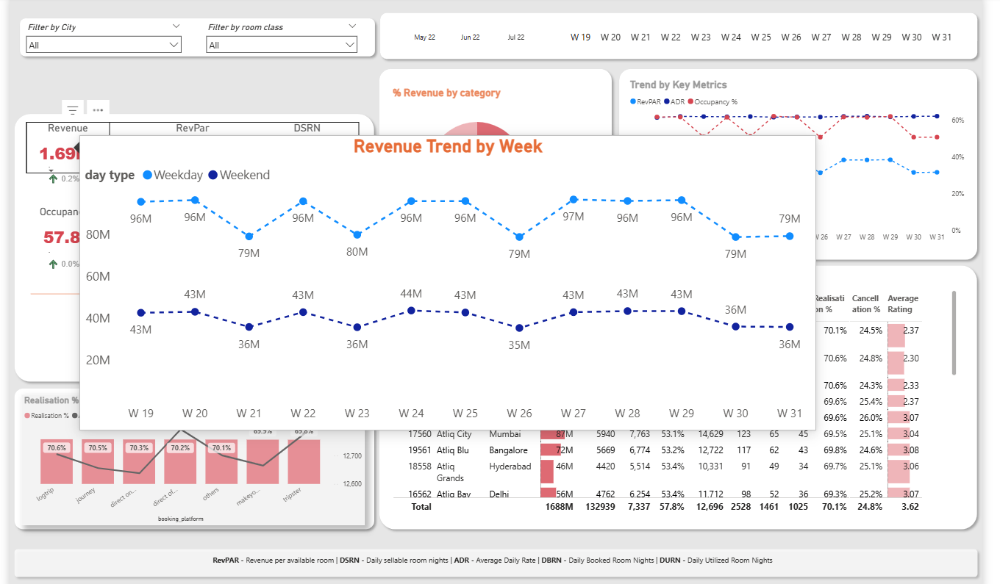

# 📊 Revenue Insights in Hospitality Domain

## 🚀 Project Overview
This project is an **end-to-end Data Analytics solution** built using **Power BI** to generate actionable revenue insights in the hospitality industry.

The project simulates a real-world scenario where a hotel chain is facing **declining revenue and market share**, and requires data-driven decision-making to improve performance.

---

## 🎯 Problem Statement
AtliQ Grands, a hotel chain operating across multiple cities, is facing:

- Increasing competition  
- Ineffective pricing strategies  
- Lack of data-driven decision-making  

The goal is to analyze historical booking data and build a dashboard that helps stakeholders:
- Understand business performance  
- Identify revenue opportunities  
- Make better strategic decisions  

---

## 🧠 Key Business Metrics
- **Occupancy %** → Rooms occupied / Total rooms available  
- **ADR (Average Daily Rate)** → Average revenue per room sold  
- **RevPAR (Revenue per Available Room)** → Revenue / Total rooms  
- **Realization %** → Successful check-ins / Total bookings  
- **DSRN (Daily Sellable Room Nights)**  

---

## 🛠️ Tech Stack
- **Power BI** – Data visualization & dashboard  
- **Excel / CSV** – Data source  
- **DAX** – Calculated measures  
- **Data Modeling** – Star schema  

---

## 📂 Dataset Description
The dataset contains:

- Hotel details (city, property type)  
- Room categories  
- Booking data (check-in, check-out, revenue)  
- Date table (weekday/weekend classification)  

---

## 📊 Dashboard Features
- KPI cards (Revenue, Occupancy %, ADR, RevPAR)  
- Weekly trends and performance analysis  
- City-wise and property-wise insights  
- Weekday vs Weekend comparison  
- Interactive filters (city, room type, date)  
- Revenue loss analysis (cancellations & no-shows)  

---

## 💡 Key Insights
- Lack of dynamic pricing leads to revenue loss  
- Flat ADR shows missed opportunities during high demand  
- Customer ratings impact occupancy significantly  
- High cancellations reduce actual revenue  
- Clear weekday vs weekend demand patterns  

---

## 📈 Project Workflow
1. Understanding business problem  
2. Data cleaning & transformation  
3. Data modeling  
4. Creating KPIs using DAX  
5. Dashboard design  
6. Generating insights  

---

## 📸 Dashboard Preview

| Dashboard View 1 | Dashboard View 2 |
|----------------|------------------|
|  |  |

---

## 🔗 Project Link
👉 https://github.com/sonu786786/Revenue-Insights-in-Hospitality-Domain  

---

## 🏆 What I Learned
- Business understanding of hospitality domain  
- Data modeling in Power BI  
- Writing DAX measures  
- Building interactive dashboards  
- Turning data into insights  

---

## 💼 Why This Project Matters
This project demonstrates:
- Strong data analysis skills  
- Business problem-solving ability  
- Power BI expertise  
- Understanding of key KPIs  

---

## 📢 Connect With Me
Feel free to connect for feedback or collaboration!

---

# ⭐ If you found this useful, please star the repo!
